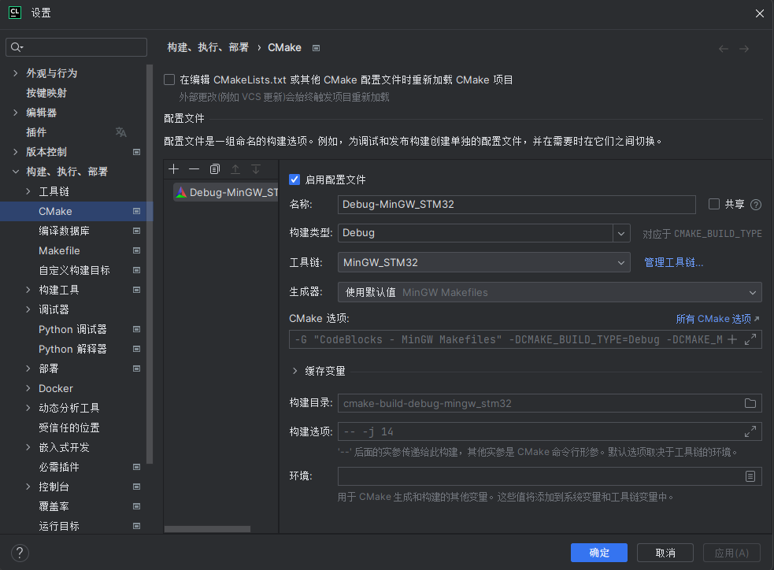
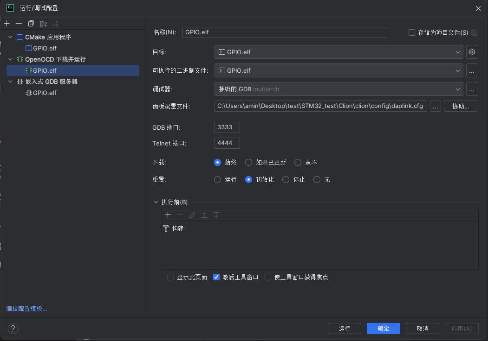
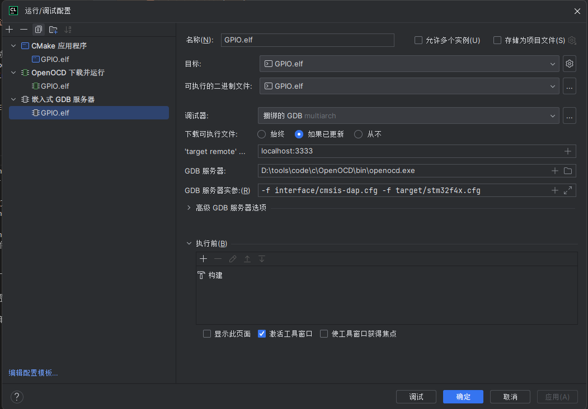

# CLion_STM32
- 选择MinGW_STM32作为CLion的配置文件

---
# 运行调试配置:
- 1.CMakeLists.txt对应的CMake应用程序:构建工程,形成hex文件=>STM32CUBEMX自动生成  
    - 外部添加的dap文件:修改CMakeLists_template.txt  
        - 在文件中的include_directories和add_definitions中添加dap库配置:
            ```
            add_definitions(-DARM_MATH_CM3-DARM_MATH_MATRIX_CHECK-DARM_MATH_ROUNDING)  
            #添加外部文件的头文件路径
            include_directories("DSP/Include") 
            #添加外部头文件对应的.c的路径
            link_directories(DSP/Lib/GCC)
            #添加外部链接库
            link_libraries(libarm_cortexM3l_math.a)```
- 2.OpenOCD下载并运行:将hex文件下载到单片机上并运行:
    - 选择对应的面板配置文件:  
    - OpenOCD的面板配置cfg文件(自己写,模板见config文件夹):  
        - 接口配置文件:OpenOCD下载位置的share\openocd\scripts\interface中查找接口配置文件
        - 芯片配置文件:OpenOCD下载位置的share\openocd\scripts\target中查找芯片型号对应的配置文件(不能使用target-st中的.cfg文件)

- 3.嵌入式GDB服务器:对单片机进行调试:
    - 配置:
        - target remote:localhost:端口(和OpenOCD下载并运行中的GDB端口一致)
        - GDB服务器:openocd对应的exe文件
        - GDB服务器实参:-f 接口配置文件 -f 芯片配置文件

    - 开始进行调试时,查看寄存器的值需要点击内存添加单片机芯片对应的SVD文件(SVD文件到stm32官网上搜索STM32F4 SVD进行下载)